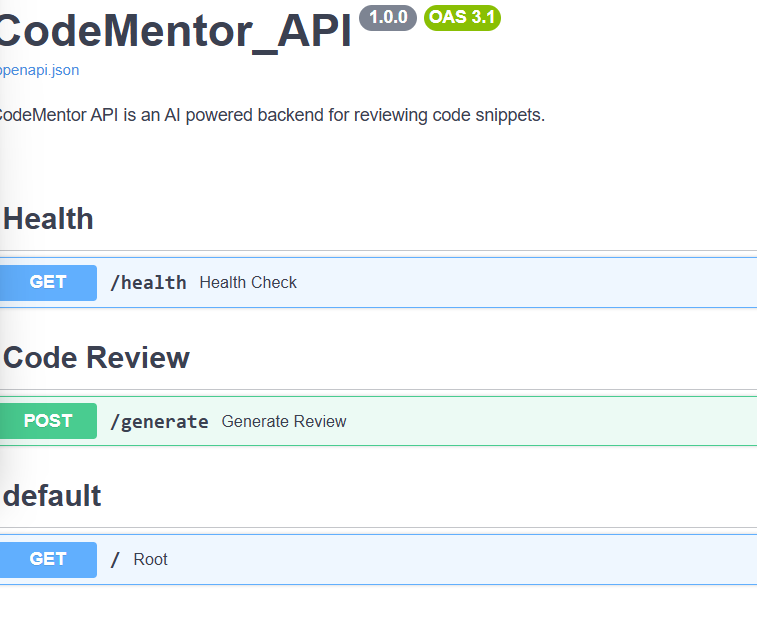
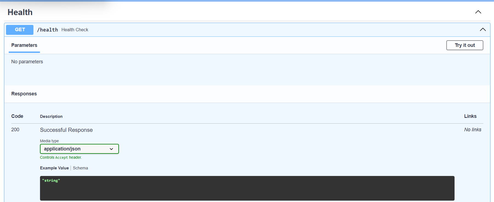
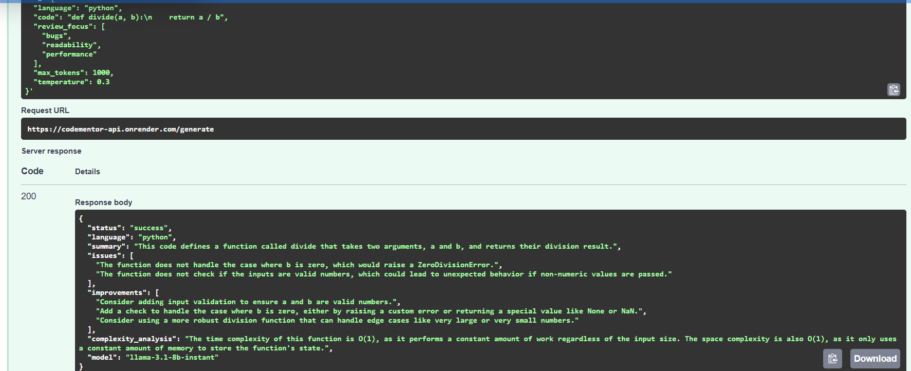
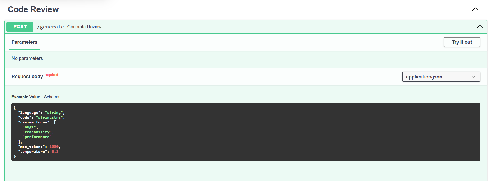

# CodeMentor API

CodeMentor API is a FastAPI backend that reviews code snippets using an AI powered endpoint.

The API accepts programming code as input and returns a structured review containing a code summary, possible issues, improvement suggestions, complexity analysis, and security observations.

---

## Live Swagger UI

### Deployed Swagger UI

```text
https://codementor-api.onrender.com/docs
```

### Local Swagger UI

```text
http://127.0.0.1:8000/docs
```


---

## Project Overview

CodeMentor API was built as a backend focused AI project using FastAPI and Groq.

The main goal of this project is to provide a clean API that accepts code snippets and returns useful AI generated code review feedback.

The project follows this workflow:

```text
User sends code
↓
POST /generate
↓
Pydantic validates request
↓
Review service handles business logic
↓
Prompt builder creates AI prompt
↓
Groq service calls the AI model
↓
Response formatter structures the AI output
↓
API returns final review response
```

---

## Features

- FastAPI backend
- AI powered code review endpoint
- Groq API integration
- Pydantic request and response validation
- Structured JSON response
- Environment based configuration
- Console based logging
- Docker support
- Docker Compose support
- Render deployment
- Swagger UI documentation

---

## Tech Stack

```text
Python
FastAPI
Pydantic
Groq API
Uvicorn
Docker
Docker Compose
Render
Markdown
```

---

## Project Structure

```text
CodeMentor_api/
│
├── app/
│   ├── routes/
│   │   ├── health.py
│   │   └── review.py
│   │
│   ├── schemas/
│   │   ├── review_request.py
│   │   └── review_response.py
│   │
│   ├── services/
│   │   ├── groq_service.py
│   │   ├── prompt_builder.py
│   │   └── review_service.py
│   │
│   ├── utils/
│   │   ├── config.py
│   │   ├── logger.py
│   │   └── response_formatter.py
│   │
│   └── main.py
│
├── docs/
│   ├── images/
│   │   ├── swagger-ui.png
│   │   ├── health-route.png
│   │   ├── generate-request.png
│   │   ├── generate-response.png
│   │   └── render-deployment.png
│   │
│   ├── API_DOCUMENTATION.md
│   └── PROJECT_WORKFLOW.md
│
├── requirements.txt
├── Dockerfile
├── docker-compose.yml
├── .dockerignore
├── .gitignore
├── README.md
└── .env
```

---

## Development Workflow

### Phase 0 - Initial setup and dependencies

- Created project folder structure
- Created virtual environment
- Added `.gitignore`
- Added `.env`
- Added required dependencies in `requirements.txt`
- Installed project dependencies
- Initialized Git
- Connected local project with GitHub repository

---

### Step 1 - FastAPI base application

- Added base FastAPI app in `app/main.py`
- Added root endpoint
- Loaded app name and version from `.env`
- Added configuration file under `app/utils/config.py`
- Tested root endpoint locally
- Checked Swagger UI

Endpoint added:

```text
GET /
```

---

### Step 2 - Health route

- Added health route under `app/routes/health.py`
- Registered health route in `app/main.py`
- Tested health endpoint locally
- Verified endpoint in Swagger UI

Endpoint added:

```text
GET /health
```

---

### Step 3 - Review request and response schemas

- Added request schema for code review input
- Added response schema for structured code review output
- Added validation for language, code, max tokens, and temperature
- Verified schema files

Files added:

```text
app/schemas/review_request.py
app/schemas/review_response.py
```

---

### Step 4 - Logger setup

- Added reusable logger under `app/utils/logger.py`
- Configured console based logging
- Used logger in main and route files
- Tested log output locally through terminal

---

### Step 5 - Generate route with dummy review service

- Added `POST /generate` route
- Added dummy review service
- Connected route with service layer
- Registered review route in `app/main.py`
- Tested request and response flow using Swagger UI

Endpoint added:

```text
POST /generate
```

---

### Step 6 - Prompt builder service

- Added prompt builder service
- Created structured AI prompt for code review
- Connected prompt builder with review service
- Logged prompt creation
- Tested `/generate` endpoint with prompt builder connected

File added:

```text
app/services/prompt_builder.py
```

---

### Step 7 - Groq service setup

- Added Groq service
- Loaded Groq API key and model from `.env`
- Added function to call Groq chat completion API
- Added error handling for missing API key and failed Groq calls
- Tested Groq service directly from terminal

File added:

```text
app/services/groq_service.py
```

---

### Step 8 - Connected Groq with review service

- Removed dummy response from review service
- Connected review service with Groq service
- Updated prompt builder to request JSON output
- Added response formatter
- Converted raw AI output into structured response
- Added error handling in review route
- Tested `POST /generate` using Swagger UI

---

### Step 9 - Dockerization

- Added `Dockerfile`
- Added `docker-compose.yml`
- Added `.dockerignore`
- Configured Docker container to run FastAPI using Uvicorn
- Loaded environment variables using `.env`
- Tested API inside Docker using Swagger UI

Docker command:

```bash
docker compose up --build
```

---

### Step 10 - Render deployment

- Updated Dockerfile for Render deployment
- Configured Uvicorn to use Render provided `PORT`
- Pushed latest code to GitHub
- Created Render Web Service from GitHub repository
- Added environment variables on Render dashboard
- Deployed Dockerized FastAPI app on Render
- Tested deployed Swagger UI using Render public URL

---

## API Endpoints

| Method | Endpoint | Description |
|---|---|---|
| GET | `/` | Root endpoint |
| GET | `/health` | Health check endpoint |
| POST | `/generate` | Generates AI based code review |

---

## Environment Variables

Create a `.env` file in the project root.

```env
APP_NAME="CodeMentor API"
APP_VERSION="1.0.0"

GROQ_API_KEY="your_groq_api_key_here"
GROQ_MODEL="llama-3.1-8b-instant"

DEFAULT_MAX_TOKENS=1000
DEFAULT_TEMPERATURE=0.3
```


---

## Run Locally

Clone the repository:

```bash
git clone https://github.com/YOUR_USERNAME/CodeMentor_api.git
cd CodeMentor_api
```

Create virtual environment:

```bash
python -m venv .venv
```

Activate virtual environment:

```bash
.venv\Scripts\activate
```

Install dependencies:

```bash
pip install -r requirements.txt
```

Run the FastAPI app:

```bash
uvicorn app.main:app --reload
```

Open Swagger UI:

```text
http://127.0.0.1:8000/docs
```

---

## Run with Docker

Build and start the container:

```bash
docker compose up --build
```

Open Swagger UI:

```text
http://127.0.0.1:8000/docs
```

Stop the container:

```bash
docker compose down
```

---

## Run Deployed Version

Open the deployed Swagger UI:

```text
https://YOUR_RENDER_URL.onrender.com/docs
```

Test the available endpoints directly from Swagger UI.

---

## Sample API Request

Endpoint:

```text
POST /generate
```

Request body:

```json
{
  "language": "python",
  "code": "def divide(a, b):\n    return a / b",
  "review_focus": ["bugs", "readability", "security"],
  "max_tokens": 1000,
  "temperature": 0.3
}
```

---

## Sample API Response

```json
{
  "status": "success",
  "language": "python",
  "summary": "The code defines a function that divides one value by another.",
  "issues": [
    "The function does not handle division by zero."
  ],
  "improvements": [
    "Add validation to prevent division by zero."
  ],
  "complexity_analysis": "The time complexity is O(1) and the space complexity is O(1).",
  "security_notes": [
    "No major security concerns found."
  ],
  "model": "llama-3.1-8b-instant"
}
```

---

## Screenshots

```text
docs/images/
```

```text
Swagger_UI.png
Health_Route.png
Response_generated.png
Review_Route.png

```

### Swagger UI



---

### Health Route



---

### Generate Response



---

### Code Review Route




## Future Improvements

- Add user authentication
- Add support for multiple programming languages with language specific review prompts
- Add severity levels for detected issues
- Add code quality score
- Add GitHub pull request review support
- Store review history in a database
- Add frontend dashboard for reviewing submissions

---

## Project Status

MVP completed.

The current version supports AI powered code review through a FastAPI backend, Groq integration, Docker support, and Render deployment.
